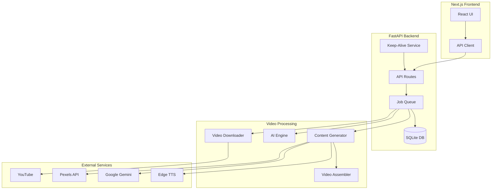

# Aigis Production-Ready Overhaul Plan

## Overview

This plan addresses critical bugs, adds competitive features inspired by ClipForge and Opus Clip, implements proper database persistence, error handling, and a keep-alive service for continuous operation on Render's free tier.

## Architecture Improvements

## Phase 1: Critical Bug Fixes

### 1.1 Fix Missing Methods and Logic Errors

- **File**: `server/app/core/engine.py`
- Add missing `detect_face_center()` method
- Fix indentation issues in `analyze_tracking()`
- Add proper error handling for face detection failures

### 1.2 Fix Video Download and Path Issues

- **File**: `server/app/core/gen_visuals.py`
- Download Pexels videos to local files instead of returning URLs
- Return file paths compatible with VideoAssembler
- Add cleanup mechanism for downloaded videos

### 1.3 Fix Frontend API Configuration

- **File**: `client/src/app/page.tsx`
- Replace hardcoded `localhost:8000` with environment variable
- Add `NEXT_PUBLIC_API_URL` support
- Handle API errors gracefully

### 1.4 Fix Database Models

- **File**: `server/app/db/models.py` (new)
- Create SQLModel classes for Job, GenerationJob
- Add proper relationships and indexes
- Update `server/app/db/engine.py` to import models

### 1.5 Fix Static File Serving

- **File**: `client/next.config.ts`
- Add `output: 'export'` for static export
- Configure proper asset paths
- **File**: `server/app/main.py`
- Serve static Next.js build files correctly
- Add proper routing for SPA

### 1.6 Fix Environment Configuration

- **File**: `server/app/core/config.py`
- Add Pydantic Settings for validation
- Add default values and error messages
- Validate required API keys on startup

### 1.7 Fix CORS Configuration

- **File**: `server/app/main.py`
- Use environment variable for allowed origins
- Add production URL support
- Allow Render domain dynamically

### 1.8 Fix Port Configuration

- **File**: `render.yaml`
- Use `$PORT` environment variable instead of hardcoded 10000
- Update start command

## Phase 2: Database Persistence

### 2.1 Implement Database Models

- **File**: `server/app/db/models.py` (new)
- `Job` model for clipping jobs
- `GenerationJob` model for AI generation jobs
- Timestamps, status tracking, error messages

### 2.2 Update Job Storage

- **File**: `server/app/core/queue.py`
- Replace in-memory storage with database
- Add job persistence on create/update
- Load jobs from DB on startup

### 2.3 Update Generation Storage

- **File**: `server/app/core/generation.py`
- Replace in-memory `jobs` dict with database
- Persist job state changes
- Add job history retrieval

## Phase 3: Error Handling & Validation

### 3.1 Add Input Validation

- **File**: `server/app/api/jobs.py`
- Validate YouTube URLs
- Add request size limits
- Validate options parameter

### 3.2 Add Error Responses

- **File**: `server/app/api/generation.py`
- Proper HTTP status codes
- Detailed error messages
- Error logging

### 3.3 Add Resource Cleanup

- **File**: `server/app/core/queue.py`
- Cleanup temp files after processing
- Add cleanup job for old files
- Monitor disk usage

## Phase 4: Competitive Features

### 4.1 Virality Prediction

- **File**: `server/app/core/virality.py` (new)
- Analyze clip characteristics (hook, pacing, captions)
- Score clips 0-100 based on viral patterns
- Return scores with generated clips

### 4.2 Animated Captions

- **File**: `server/app/core/captions.py` (new)
- Generate word-level timestamps from Whisper
- Create animated subtitle overlays using MoviePy
- Add style options (colors, fonts, animations)

### 4.3 Intelligent Clip Detection

- **File**: `server/app/core/clip_detector.py` (new)
- Analyze video for best moments (high engagement)
- Detect speaker changes, emotion peaks
- Generate multiple clip suggestions from one video
- Return timestamps and scores

### 4.4 Multi-Clip Generation

- **File**: `server/app/api/jobs.py`
- Add endpoint for generating multiple clips
- Process best moments from long video
- Return array of clips with virality scores

## Phase 5: Keep-Alive Service

### 5.1 Implement Keep-Alive

- **File**: `server/app/core/keepalive.py` (new)
- Background task that pings health endpoint every 14 minutes
- Use APScheduler for reliable timing
- Log keep-alive attempts
- Handle errors gracefully

### 5.2 Integrate with FastAPI

- **File**: `server/app/main.py`
- Start keep-alive service on startup
- Use lifespan context manager
- Ensure it runs in background

## Phase 6: Production Optimizations

### 6.1 Add Logging Configuration

- **File**: `server/app/core/logging_config.py` (new)
- Configure structlog properly
- Add file and console handlers
- Set appropriate log levels

### 6.2 Add Health Checks

- **File**: `server/app/api/health.py` (new)
- Comprehensive health endpoint
- Check database, disk space, API keys
- Return service status

### 6.3 Optimize Video Processing

- **File**: `server/app/core/engine.py`
- Add progress callbacks
- Optimize face detection (sample fewer frames)
- Add timeout handling

### 6.4 Add Rate Limiting

- **File**: `server/app/core/rate_limit.py` (new)
- Simple in-memory rate limiter
- Limit requests per IP
- Return 429 on limit exceeded

## Phase 7: Frontend Improvements

### 7.1 Improve Error Handling

- **File**: `client/src/app/page.tsx`
- Show error messages to users
- Handle network failures
- Add retry logic

### 7.2 Add Virality Scores Display

- **File**: `client/src/app/page.tsx`
- Show virality score badges
- Color-code by score
- Add tooltips explaining scores

### 7.3 Improve Job Status Updates

- **File**: `client/src/app/page.tsx`
- Better progress indicators
- Show estimated time remaining
- Add cancel job functionality

## Phase 8: Deployment Configuration

### 8.1 Update Build Script

- **File**: `build.sh`
- Add error handling
- Verify dependencies
- Create necessary directories

### 8.2 Add Environment Template

- **File**: `.env.example` (new)
- Document all required variables
- Add example values
- Include Render-specific notes

### 8.3 Update Render Configuration

- **File**: `render.yaml`
- Fix port usage
- Add environment variables section
- Configure disk mount properly

### 8.4 Add Startup Script

- **File**: `server/start.sh` (new)
- Initialize database
- Check environment variables
- Start server with proper settings

## Phase 9: Testing & Documentation

### 9.1 Add API Documentation

- **File**: `server/app/main.py`
- Improve FastAPI docs
- Add response models
- Document error codes

### 9.2 Update README

- **File**: `README.md` (new/update)
- Setup instructions
- Environment variables
- Deployment guide
- Feature list

## Implementation Order

1. **Critical Bugs First** (Phase 1) - Must fix before anything else works
2. **Database Persistence** (Phase 2) - Prevents data loss
3. **Error Handling** (Phase 3) - Improves reliability
4. **Keep-Alive Service** (Phase 5) - Enables 24/7 operation
5. **Competitive Features** (Phase 4) - Adds value
6. **Production Optimizations** (Phase 6) - Improves performance
7. **Frontend Improvements** (Phase 7) - Better UX
8. **Deployment Config** (Phase 8) - Production readiness
9. **Documentation** (Phase 9) - Maintainability

## Key Files to Create/Modify

**New Files:**

- `server/app/db/models.py` - Database models
- `server/app/core/virality.py` - Virality prediction
- `server/app/core/captions.py` - Animated captions
- `server/app/core/clip_detector.py` - Intelligent clip detection
- `server/app/core/keepalive.py` - Keep-alive service
- `server/app/core/logging_config.py` - Logging setup
- `server/app/api/health.py` - Health checks
- `server/app/core/rate_limit.py` - Rate limiting
- `.env.example` - Environment template
- `server/start.sh` - Startup script
- `README.md` - Documentation

**Modified Files:**

- `server/app/core/engine.py` - Fix bugs, add methods
- `server/app/core/gen_visuals.py` - Download videos
- `server/app/core/queue.py` - Database persistence
- `server/app/core/generation.py` - Database persistence
- `server/app/core/config.py` - Validation
- `server/app/main.py` - CORS, static files, keep-alive
- `server/app/api/jobs.py` - Validation, multi-clip
- `server/app/api/generation.py` - Error handling
- `client/src/app/page.tsx` - API URL, error handling
- `client/next.config.ts` - Static export
- `render.yaml` - Port fix
- `build.sh` - Improvements

## Success Criteria

- All critical bugs fixed
- Jobs persist across restarts
- Keep-alive prevents sleep mode
- Virality prediction works
- Animated captions render correctly
- Intelligent clip detection finds best moments